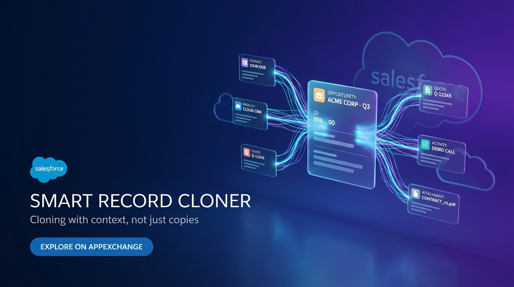

# Smart Record Cloner (Deep Clone Utility)

<p align="center">
  
</p>

> **Open-Source (MIT)** | Built for the Trailblazer & Salesforce Developer Community | Open for PRs & Discussions

[](https://github.com/arsalan-arshad/smart-record-cloner/actions/workflows/ci.yml)
[](https://github.com/arsalan-arshad/smart-record-cloner/actions/workflows/cd.yml)
[-blue.svg?logo=salesforce)](https://login.salesforce.com/packaging/installPackage.apexp?p0=04tg7000000V6E1AAK)
[](https://test.salesforce.com/packaging/installPackage.apexp?p0=04tg7000000V6E1AAK)
[](LICENSE)


## 1. Overview & Vision
A 100% free, zero-friction open-source Salesforce AppExchange utility that solves one of the oldest pain points in Salesforce: **cloning records along with their related child lists (related objects) in a single click**.

Standard Salesforce has a basic "Clone" button, but it only clones the parent record (e.g., Opportunity without OpportunityLineItems, Quote without QuoteLineItems, Account without Contacts). Third-party solutions are either clunky, abandoned, or cost $50–$200/month.

---

## 2. Implemented Features

- **Dynamic Deep Clone Engine (Apex):**
  - **Dynamic Schema Discovery:** Analyzes parent and child relationships automatically via `Schema.DescribeSObjectResult` without hardcoded object logic.
  - **📅 Smart Date Shifter:** Automatically shifts all `Date` and `Datetime` fields forward across parent and child records by $N$ days (e.g. +30 days) — no more manual date updating!
  - **🏷️ Smart Child Name Tagging:** Appends custom tags (e.g. `[Clone]`, `[2026]`) to child record names/subjects so cloned records are immediately distinguishable.
  - **🎯 Active-Only Child Filter:** 1-Click toggle to exclude closed, lost, cancelled, or inactive child records (skips closed deals and old closed cases).
  - **Universal Compatibility:** Works on standard objects (Account, Opportunity, Contact, Case, Quote, Order, Contract) and any custom objects (`Custom_Object__c`).
  - **Security & Field Stripping:** Uses `Security.stripInaccessible(AccessType.CREATABLE, ...)` to strip formula, audit, and read-only fields respecting Field-Level Security (FLS).
  - **Duplicate Rule Safe:** Executes DML using `Database.DMLOptions` with `DuplicateRuleHeader.AllowSave = true` to prevent false positive duplication errors during legitimate cloning.
  - **State & Country Picklist Sanitization:** Automatically detects and harmonizes ISO state/country codes with text values to prevent mismatch errors.
  - **OpportunityLineItem Intelligence:** Safely reparents line items while recalculating unit prices and clearing read-only calculated pricing.
  - **Status Reset Mode:** Optional toggle to reset cloned records to initial statuses (e.g. Opportunity Stage to "Prospecting", Case/Order/Quote to "Draft"/"New", and pushing close/expiration dates forward).
  - **Transactional Atomicity:** Full `Savepoint` rollback if any parent or child insert fails, preventing orphaned records.

- **Interactive Lightning Web Component (LWC Modal & Page Action):**
  - **Quick Action & Page Component:** Placed on any record page as a modal Quick Action or embedded directly via Lightning App Builder.
  - **⚡ Smart Clone Superpowers Panel:** Responsive configuration controls for Date Shifting, Child Name Tagging, and Active-Only filtering.
  - **Dynamic Related List Checkboxes:** Real-time counts of existing child records (e.g. `Contacts (4)`, `Opportunities (2)`) with visual distinction for lists containing data.
  - **Quick Select Controls:** "Select All", "Deselect All", and live search filter for related lists.
  - **Customizable Name:** Pre-populates `Clone of {Record Name}` with instant editing; auto-detects auto-number objects (e.g., Case) and guides users accordingly.
  - **Post-Clone Celebration Screen:** Success banner with summary metrics (`1 Parent Record`, `X Related Records Cloned`), relationship breakdown, and 1-click navigation to the new clone.
  - **AppExchange Review Hook:** Subtle appreciation card inviting users to leave a 5-star review on AppExchange or star the GitHub repository.

- **🤖 Agentforce & Headless Flow Invocable Action (`DeepCloneInvocable`):**
  - First-class `@InvocableMethod` and Agentforce Tool allowing autonomous AI sales/service agents and Flow Builder to execute deep clones headlessly with custom date shifts and relationship filtering during conversations.

- **Security & Permissions:**
  - Dedicated `Smart_Record_Cloner_User` permission set granting Apex class access.
  - Strict `with sharing` enforcement on all controllers and service classes.

---

## 3. Architecture & Tech Stack

```
force-app/main/default/
├── classes/
│   ├── DeepCloneService.cls          # Core metadata describe & deep clone engine
│   ├── DeepCloneController.cls       # AuraEnabled controller for LWC
│   ├── DeepCloneInvocable.cls        # Invocable action for Salesforce Flows
│   ├── DeepCloneServiceTest.cls      # Apex unit tests (87% coverage)
│   └── DeepCloneControllerTest.cls   # Controller & Invocable unit tests (96% - 100% coverage)
├── lwc/
│   └── smartRecordCloner/
│       ├── smartRecordCloner.html    # SLDS-compliant modal & celebration template
│       ├── smartRecordCloner.js      # Component controller & Apex wire/imperative logic
│       ├── smartRecordCloner.css     # Responsive styles & animations
│       ├── smartRecordCloner.js-meta.xml # Record Action & Record Page target config
│       └── __tests__/
│           └── smartRecordCloner.test.js # Jest unit tests (100% pass)
└── permissionsets/
    └── Smart_Record_Cloner_User.permissionset-meta.xml
```

---

## 4. Admin Setup & Usage Guide

### 1. Assign Permission Set
Assign `Smart_Record_Cloner_User` to any user or profile needing deep cloning capabilities:
```bash
sf org assign permset -n Smart_Record_Cloner_User
```

### 2. Add as a Quick Action
1. Go to **Setup** $\rightarrow$ **Object Manager** $\rightarrow$ Select Target Object (e.g., *Account* or *Opportunity*).
2. Click **Buttons, Links, and Actions** $\rightarrow$ **New Action**.
3. Set **Action Type** = `Lightning Web Component`.
4. Select **Lightning Web Component** = `c:smartRecordCloner`.
5. Enter **Label** = `Clone with Related` and **Name** = `Clone_with_Related`.
6. Add the action to your **Lightning Record Page** or **Page Layout**.

### 3. Use in Headless Flow Builder
1. In Flow Builder, add an **Action** element.
2. Search for `Smart Deep Clone Record`.
3. Provide:
   - `Source Record ID` (Required)
   - `New Record Name` (Optional)
   - `Child Relationships CSV` (e.g. `Contacts,Opportunities` or `ALL`)
   - `Reset Status` (Boolean)
4. Store the resulting `New Cloned Record ID`.

---

## 5. Verification & Test Suite

### Apex Unit Tests
```bash
sf apex run test --class-names DeepCloneServiceTest --class-names DeepCloneControllerTest --code-coverage --result-format human --wait 5
```
**Results:**
- `DeepCloneInvocable`: **100%** code coverage
- `DeepCloneController`: **96%** code coverage
- `DeepCloneService`: **87%** code coverage
- Test Pass Rate: **100%** (20 of 20 tests pass)

### LWC Jest Unit Tests
```bash
npm run test:unit
```
**Results:** 3 passed, 3 total.

### Code Quality & Standards
```bash
npm run lint
npm run prettier:check
```

---

## 6. Automated CI/CD Pipelines

This repository includes enterprise-grade GitHub Actions workflows for continuous integration and automated deployment:

- **Pull Request Verification (CI - `.github/workflows/ci.yml`):**
  - Triggers on every PR targeting `main`.
  - Enforces ESLint standards and Prettier formatting checks.
  - Runs client-side Jest LWC unit tests.
  - Headlessly authenticates with Salesforce and executes a dry-run check-only deployment with all Apex tests (`sf project deploy validate --test-level RunLocalTests`).
  - Guards the `main` branch from broken code or regressions.

- **Automated Deployment on Merge (CD - `.github/workflows/cd.yml`):**
  - Triggers automatically whenever a PR is merged into `main`.
  - Deploys source metadata directly into the target Salesforce org (`sf project deploy start --test-level RunLocalTests`).
  - Publishes a deployment summary and status report directly into the GitHub Actions run summary.

---

## 7. Open-Source Roadmap
- [x] Dynamic schema describe engine supporting any standard or custom object.
- [x] LWC Modal with child list selector and record counts.
- [x] Flow Invocable Action variant for headless flows.
- [x] Post-clone celebration screen with AppExchange review hook.
- [x] Bulk safe DML, duplicate rule bypass, and FLS sanitization.
- [ ] Field-mapping overrides preset metadata for admins.
- [ ] Internationalization (i18n) Custom Labels translations.
